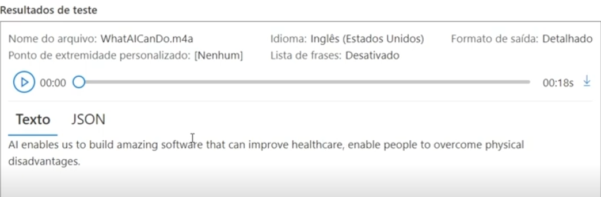

## Laboratório de Linguagem Natural

### Testes Speech Studio

Com o [Speech Studio](https://speech.microsoft.com/portal/5d1aabba5ddd4f7ca544a76ffb874425/speechtotexttool) aberto, foram realizados testes de conversão de fala em texto em tempo real.  
Neste recurso, podemos selecionar arquivos de áudio especificos e a ferramenta irá trancreve-los para nós.  

__Exemplo__

### Testes Language Studio

Com o [Language Studio](https://portal.azure.com/#create/Microsoft.CognitiveServicesTextAnalytics), temos várias opções de analise de texto, mas em especifico será utilizado a __Classificação de Texto__, para fazer uma analise de sentimentos do cliente utilizando resenhas.

__Exemplo__

